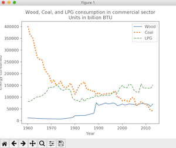
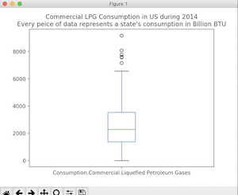

# Data Visualization Project
## Energy Consumption in the US

This first graph shows the past 54 years of our country’s consumption of wood, coal, and liquefied petroleum gas in the commercial sector. As we can see from the graph, coal consumption has decreased significantly, more precisely by a factor of about 1/8 of what it was in 1960. We can also see that wood and LPG is being consumed at a greater level.In this context, “consumption” means “how much we are burning”. This graph could help us to make a correlation between air pollution and consumption of these CO^2 emitting sources of energy.

This graph illustrates the states consumption habits of 54 years. California’s habits are more sporadic, while consumption rates are still predictably trending upward. North Carolina is has been far less sporadic and is also trending upward.

This graph represents the consumption of LPG of all states in the US over one year. We can see that the median is around 2000 BTU and the outliers close to 8000 BTU representing states like California and North Carolina.

Examples Used

http://matplotlib.org/examples/lines_bars_and_markers/barh_demo.html! http://matplotlib.org/examples/api/date_index_formatter.html! http://matplotlib.org/examples/statistics/histogram_demo_multihist.html! http://matplotlib.org/examples/pylab_examples/legend_demo3.html! http://matplotlib.org/users/pyplot_tutorial.html! https://github.com/pandas-dev/pandas/blob/master/doc/cheatsheet/Pandas_Cheat_Sheet.pdf!
